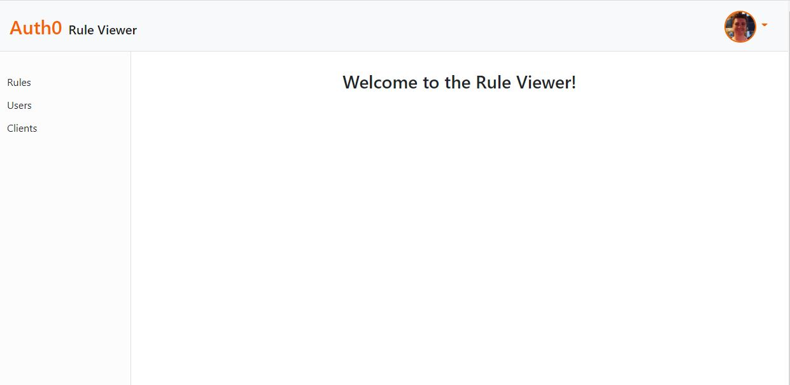

# Auth0 Rule Viewer 
  [](https://github.com/wilsoncollin7?tab=followers) [](https://opensource.org/licenses/MIT)

  This app lets the user list all rules, users, and clients associated with their tenant in Auth0. The idea of this application is to help Auth0 users generate at anytime a list of all of their apps and the rules that apply to each of those apps. There is a TON of functionality that can be added to this in the future! :rocket:

  

  ## Installation

  Download this repo. Then you will need to create a auth_config.json file in the public folder that fits this model:

  ```
  {
    "domain": "[APPLICATION_DOMAIN]",
    "clientId": "[CLIENT_ID]",
    "audience": "[MANAGEMENT_SYSTEM_API_IDENTIFIER]",
    "token": "[MANAGEMENT_SYSTEM_API_TOKEN]",
    "whitelist": [ALL_EMAILS_ON_YOUR_WHITELIST]
  }
  ```
  To generate the management API access token in the API explorer inside of you Auth0 Management API in your dashboard. Here is a link to help walk you through this: [Get Management API Access Tokens for Testing](https://auth0.com/docs/tokens/management-api-access-tokens/get-management-api-access-tokens-for-testing).
  
  :warning: The token does expire after 24 hours, this can be configured but makes the token less secure.

  ## Usage

  This is an express app that uses axios to call the APIs. All dependencies are in the package.json. Run:
  
  ```
  npm i
  nodemon server.js
  ```

  ## License

  This aplication is made with the [MIT License](https://opensource.org/licenses/MIT)

  ## Questions

  For any questions you might have, you can email me at wilsoncollin7@gmail.com. You can also check out my [GitHub Profile](https://github.com/wilsoncollin7).
